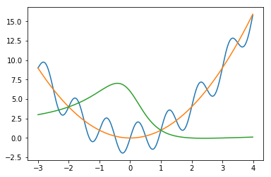
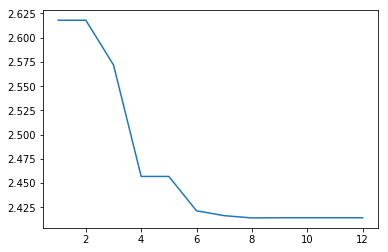

SciPy Minimize
==============

One Dimensional Methods
-----------------------

.. code:: ipython3

    # Importing the packages for the example
    import numpy as np
    import scipy.optimize as optimize
    import matplotlib.pyplot as plt

.. code:: ipython3

    # An example function with many parameters
    f = lambda x: ( x**2 + 2* np.sin(2*np.pi*x) )
    
    # A function that uses a parameter
    g = lambda x , a : (x-a)**2  
    
    # A function that takes longer to converge
    h = lambda x : (x**2 - 5*x + 6)/(x**2 + 1)
    
    x=np.arange(-3,4,.01)
    plt.plot(x,f(x)) 
    plt.plot(x,g(x,0))
    plt.plot(x,h(x))

.. parsed-literal::

    [<matplotlib.lines.Line2D at 0x7f35248aa7f0>]

Basic Usage and Result
~~~~~~~~~~~~~~~~~~~~~~

.. code:: ipython3

    result=optimize.minimize_scalar(f)
    print(result)

.. parsed-literal::

         fun: -1.9390442217474881
        nfev: 15
         nit: 11
     success: True
           x: -0.24382235612367698

The function returns a special variable type based on a dictionary that
can store more information. Individual components can be accessed by:

.. code:: ipython3

    result.x

.. parsed-literal::

    -0.24382235612367698

Availible components can be determined by calling:

.. code:: ipython3

    result.keys()

.. parsed-literal::

    dict_keys(['fun', 'x', 'nit', 'nfev', 'success'])

Choosing Methods
~~~~~~~~~~~~~~~~

SciPy Optimize comes with three 1D methods

-  Brent
-  Golden
-  Bounded

Brent's method is the default, and it uses inverse quadratic
interpolation.

Both Brent's method and the Golden Method both rely on brackets or a set
of three numbers ``a``,\ ``b``,\ ``c`` such that ``f(b)`` is less than
both ``f(a)`` and ``f(c)``.

The bounded method instead uses bounds, which only has the two
endpoints. While brackets are optional for Brent's and Golden, initial
bounds are required to start the Bounded Method.

I include time profiling of the three methods, and you can see that even
for a simple, straightforward function, Brent's method runs much faster
with fewer iterations and function evaluations.

.. code:: ipython3

    %timeit optimize.minimize_scalar(f,method='Brent')
    optimize.minimize_scalar(f,method='Brent')

.. parsed-literal::

    125 µs ± 4.29 µs per loop (mean ± std. dev. of 7 runs, 10000 loops each)

.. parsed-literal::

         fun: -1.9390442217474881
        nfev: 15
         nit: 11
     success: True
           x: -0.24382235612367698

.. code:: ipython3

    %timeit optimize.minimize_scalar(f,method='golden')
    optimize.minimize_scalar(f,method='golden')

.. parsed-literal::

    140 µs ± 2.52 µs per loop (mean ± std. dev. of 7 runs, 10000 loops each)

.. parsed-literal::

         fun: -1.9390442217474881
        nfev: 46
         nit: 41
     success: True
           x: -0.2438223579554442

.. code:: ipython3

    %timeit optimize.minimize_scalar(f,method='bounded',bounds=[-1,1])
    optimize.minimize_scalar(f,method='bounded',bounds=[-1,1])

.. parsed-literal::

    206 µs ± 10.7 µs per loop (mean ± std. dev. of 7 runs, 1000 loops each)

.. parsed-literal::

         fun: -1.9390442216809054
     message: 'Solution found.'
        nfev: 9
      status: 0
     success: True
           x: -0.24382363945219096

Bracketing
~~~~~~~~~~

.. code:: ipython3

    # Use a bracket to choose which local minimum 
    optimize.minimize_scalar(f,bracket=[0.25,1,2])

.. parsed-literal::

         fun: -1.4514116620602204
        nfev: 14
         nit: 10
     success: True
           x: 0.7314305452922458

Flags
~~~~~

The ``args`` variable flag passes additional parameters to the function.

.. code:: ipython3

    # 2 passes to g, controlling the minimum location
    # minimizing g(x,2)
    optimize.minimize_scalar(g, args=(2))

.. parsed-literal::

         fun: 4.930380657631324e-32
        nfev: 9
         nit: 4
     success: True
           x: 1.9999999999999998

Options
~~~~~~~

The maximum number of iterations ``maxiter`` or tolerance for x
difference between successive steps ``xtol`` can be passed in a
dictionary to the flag ``options``.

While most 1D functions converge in a trivial amount of time, sometimes
you may want manual control to avoid excessive resources or your problem
requires extreme accuracy.

.. code:: ipython3

    # The simple case
    optimize.minimize_scalar(h)

.. parsed-literal::

         fun: -0.0355339059327378
        nfev: 19
         nit: 13
     success: True
           x: 2.4142135621371947

.. code:: ipython3

    # Simple example to change maxiter
    optimize.minimize_scalar(h,options={'maxiter':4})

.. parsed-literal::

         fun: -0.03526620646182484
        nfev: 10
         nit: 4
     success: False
           x: 2.4568626637256976

.. code:: ipython3

    n=np.arange(1,13)
    x_n=np.zeros(12)
    for ii in n:
        result=optimize.minimize_scalar(h,options={'maxiter':ii})
        x_n[ii-1]=result.x
    
    plt.plot(n,x_n)

.. parsed-literal::

    [<matplotlib.lines.Line2D at 0x7f352497fdd8>]

.. code:: ipython3

    optimize.minimize_scalar(h,options={'xtol':.1})

.. parsed-literal::

         fun: -0.03500252864128803
        nfev: 9
         nit: 3
     success: True
           x: 2.35623059999

