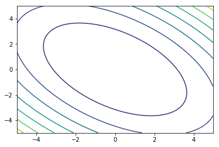
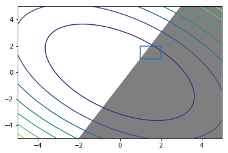

SciPy Minimize
==============

Multidimensional Methods
------------------------

-  `Gradients and Hessians <#gradients_hessians>`__
-  `Routine Comparison <#routine_comparison>`__
-  `Bounds and Constraints <#bounds_constraints>`__

.. code:: ipython3

    # Importing the packages for the example
    import numpy as np
    import scipy.optimize as optimize
    import matplotlib.pyplot as plt

Function Form
~~~~~~~~~~~~~

The routine ``minimize`` optimizes over an array variable. Each
component of the array represents a dimension. Any additional function
variables are parameters that can be passed via the flag ``args=`` to
the routine.

.. code:: ipython3

    f = lambda x : x[0]**2 + x[1]**2 + x[0]*x[1]
    
    x0 = np.arange(-5,5,.01)
    x1 = np.arange(-5,5,.01)
    x0_a, x1_a = np.meshgrid(x0,x1)
    
    fig, ax = plt.subplots()
    CS = ax.contour(x_a,y_a,f([x_a,y_a]))

.. code:: ipython3

    optimize.minimize(f,[1,1])

.. parsed-literal::

          fun: 1.5869182200826406e-16
     hess_inv: array([[ 0.66666667, -0.33333333],
           [-0.33333333,  0.66666667]])
          jac: array([-6.91799246e-09, -6.91799246e-09])
      message: 'Optimization terminated successfully.'
         nfev: 12
          nit: 2
         njev: 3
       status: 0
      success: True
            x: array([-7.27305122e-09, -7.27305122e-09])

.. raw:: html

   

Gradients and Hessians
~~~~~~~~~~~~~~~~~~~~~~

Note: function returns need to be NumPy arrays

Rountines in the Newton-type category use the first derivative gradient
(Jacobian) and potentially second derivative Hessian.

.. code:: ipython3

    def df (x):
        df_dx0 = 2*x[0] + x[1]
        df_dx1 = 2*x[1] + x[0]
        return np.array([df_dx0, df_dx1])
    
    def d2f (x): 
        d2f_dx02 = 2
        d2f_dx12 = 2
        d2f_dx1dx0 = 1
        return np.array([[d2f_dx02, d2f_dx1dx0],
                        [ d2f_dx1dx0 , d2f_dx12]])

And how to pass that to minimize:

.. code:: ipython3

    optimize.minimize(f,[1,1],jac=df)

.. parsed-literal::

          fun: 3.697785493223493e-32
     hess_inv: array([[ 0.66666667, -0.33333333],
           [-0.33333333,  0.66666667]])
          jac: array([3.33066907e-16, 3.33066907e-16])
      message: 'Optimization terminated successfully.'
         nfev: 3
          nit: 2
         njev: 3
       status: 0
      success: True
            x: array([1.11022302e-16, 1.11022302e-16])

And to add the Hessian, I change the method to ``Newton-CG``, as that
method actually uses the Hessian:

.. code:: ipython3

    optimize.minimize(f,[1,1],jac=df,hess=d2f,method='Newton-CG')

.. parsed-literal::

         fun: 0.0
         jac: array([0., 0.])
     message: 'Optimization terminated successfully.'
        nfev: 3
        nhev: 2
         nit: 2
        njev: 4
      status: 0
     success: True
           x: array([0., 0.])

Let's just double check our manual derivatives. Maybe something went
wrong. Luckily, ``optimize`` provides a rountine for this:

.. code:: ipython3

    optimize.check_grad(f,df,[1,1])

.. parsed-literal::

    0.0

By returning ``0.0``, the rountine confirms that our manual gradient is
identical to a finite derivative method at ``[1,1]``.

If we don't provide derivative functions, ``minimize`` will use a finite
derivative approximation. We can take a look at this finite derivative
method itself:

.. code:: ipython3

    optimize.approx_fprime([1,1],f, np.array([1e-6,1e-6]) )

.. parsed-literal::

    array([3.000001, 3.000001])

.. raw:: html

   

Routine Comparison
~~~~~~~~~~~~~~~~~~

+----------------------+------------+----------------+---------------+---------------+
| Routine              | Gradient   | Hessian        | Line Search   | Constraints   |
+======================+============+================+===============+===============+
| Nelder- Mead         | no         | no             | no            | no            |
+----------------------+------------+----------------+---------------+---------------+
| Powell               | no         | no             | yes           | no            |
+----------------------+------------+----------------+---------------+---------------+
| Conjugate Gradient   | yes        | no             | no            | no            |
+----------------------+------------+----------------+---------------+---------------+
| BFGS                 | yes        | approximated   | no            | no            |
+----------------------+------------+----------------+---------------+---------------+
| L-BFGS               |            |
+----------------------+------------+----------------+---------------+---------------+

L-BFGS suitable for large numbers of variables Quasi-Newton methods:
Hessian approximated by recent evaluations

Constraints: \* Constrained optimization by linear approximation COBYLA
\* Sequential Quadratic Programming SLSQP \* trust-constr 1

.. raw:: html

   

Bounds and Constraints for ``trust-constr``
~~~~~~~~~~~~~~~~~~~~~~~~~~~~~~~~~~~~~~~~~~~

Bound

.. math::

   1 < x_0, x_1 <2

Linear Constraint

.. math::

   x_0 < 2 x_1 - 1

.. math::

   1 < - 1  x_0 + 2 x_1 < \infty

.. code:: ipython3

    fig, ax = plt.subplots()
    plt.ylim(-5,5)
    ax.contour(x_a,y_a,f([x_a,y_a]))
    ax.plot([1,1,2,2,1],[1,2,2,1,1])
    ax.fill_between(x,2*x-1,-5,color='tab:grey')

.. parsed-literal::

    <matplotlib.collections.PolyCollection at 0x7f4f602a5748>

.. code:: ipython3

    bounds=optimize.Bounds([1,1],[2,2])
    optimize.minimize(f,[1.5,1.5],bounds=bounds)

.. parsed-literal::

          fun: 3.0
     hess_inv: <2x2 LbfgsInvHessProduct with dtype=float64>
          jac: array([2.99999998, 2.99999998])
      message: b'CONVERGENCE: NORM_OF_PROJECTED_GRADIENT_<=_PGTOL'
         nfev: 6
          nit: 1
       status: 0
      success: True
            x: array([1., 1.])

.. code:: ipython3

    linear_constraint = optimize.LinearConstraint([-1,2],1,np.inf)

.. code:: ipython3

    optimize.minimize(f,[2,0],method='trust-constr',jac=df,hess=d2f,
                      constraints=[linear_constraint])

.. parsed-literal::

     barrier_parameter: 0.00016000000000000007
     barrier_tolerance: 0.00016000000000000007
              cg_niter: 9
          cg_stop_cond: 1
                constr: [array([1.00075882])]
           constr_nfev: [0]
           constr_nhev: [0]
           constr_njev: [0]
        constr_penalty: 1.0
      constr_violation: 0.0
        execution_time: 0.023283958435058594
                   fun: 0.10730552310463037
                  grad: array([-0.21444832,  0.42889664])
                   jac: [array([[-1,  2]])]
       lagrangian_grad: array([-4.13959866e-10,  8.27919566e-10])
               message: '`gtol` termination condition is satisfied.'
                method: 'tr_interior_point'
                  nfev: 7
                  nhev: 7
                 niter: 11
                  njev: 7
            optimality: 8.279195662375116e-10
                status: 1
             tr_radius: 6974.7904216717125
                     v: [array([-0.21444832])]
                     x: array([-0.28593109,  0.35741386])

