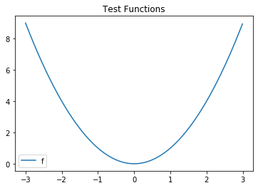

SciPy ``minimize_scalar``
=========================

``scipy.optimize.minimize_scalar`` determines the lowest value in a
local neighborhood of a one-dimensional scalar-valued function.

.. math::


   \text{min}_x f(x) \qquad f : \mathbb{R} \rightarrow \mathbb{R}

```scipy.optimize.minimize`` <./Optimization_ND.ipynb>`__ is a
generalization for multidimensional scalar-valued functions. The
submodule also offers a series of global optimization routines, that
work to find the lowest value on an entire range, instead of a local
neighborhood.

To use the function, you first need to import the ``scipy.optimize``
submodule. SciPy works on top of NumPy, so we import that as well, and
we use PyPlot to look at the data.

.. code:: ipython3

    # Importing the packages
    from scipy import optimize
    import numpy as np
    import matplotlib.pyplot as plt

.. raw:: html

   <div id="test_function" />

Test Function
-------------

.. raw:: html

   <hr/>

For the example, we use the test function:

.. math::


   f(x) = x^2

 which has a single minimum at :math:`x=0`.

.. code:: ipython3

    # An example function with many minimums
    f = lambda x: x**2

We can visually look at this function to verify that this is indeed a
local minimum.

.. code:: ipython3

    x = np.arange(-3,3,.01)
    plt.plot(x,f(x),label="f") 
    plt.legend()
    plt.title("Test Functions")


.. parsed-literal::

    Text(0.5, 1.0, 'Test Functions')





Basic Usage
-----------

.. raw:: html

   <hr />

At its simplest, ``minimize_scalar`` only requires the function.

.. code:: ipython3

    result = optimize.minimize_scalar(f)
    print(result)


.. parsed-literal::

         fun: 0.0
        nfev: 8
         nit: 4
     success: True
           x: 0.0


Result
------

.. raw:: html

   <hr/>

The function returns a special variable type based on a dictionary that
can store more information. Individual components can be accessed by:

.. code:: ipython3

    result.x


.. parsed-literal::

    0.0


Available components can be determined by calling:

.. code:: ipython3

    result.keys()


.. parsed-literal::

    dict_keys(['fun', 'x', 'nit', 'nfev', 'success'])


Args
----

.. raw:: html

   <hr>

The ``args`` variable flag passes additional parameters via a tuple to
the function.

In the example, I shift the minimum via a parameter ``a``.

.. code:: ipython3

    # A function that uses a parameter
    f_parameter = lambda x , a : (x-a)**2
    
    result_parameter = optimize.minimize_scalar(f_parameter, args=(2,))
    print(result_parameter)


.. parsed-literal::

         fun: 4.930380657631324e-32
        nfev: 9
         nit: 4
     success: True
           x: 1.9999999999999998


Choosing Methods
----------------

.. raw:: html

   <hr />

SciPy Optimize comes with three 1D methods:

-  Brent
-  Golden
-  Bounded

Brent’s method is the default, and it uses inverse quadratic
interpolation.

Both Brent’s method and the Golden Method both rely on brackets or a set
of three numbers ``a``,\ ``b``,\ ``c`` such that ``f(b)`` is less than
both ``f(a)`` and ``f(c)``.

The bounded method instead uses bounds, which only has the two
endpoints. While brackets are optional for Brent’s and Golden, initial
bounds are required to start the Bounded Method.

.. code:: ipython3

    result_Brent = optimize.minimize_scalar(f,method='Brent')
    print(result_Brent)


.. parsed-literal::

         fun: 0.0
        nfev: 8
         nit: 4
     success: True
           x: 0.0


.. code:: ipython3

    result_golden = optimize.minimize_scalar(f,method='golden')
    print(result_golden)


.. parsed-literal::

         fun: 0.0
        nfev: 818
         nit: 813
     success: True
           x: 1.5717277788484873e-162


.. code:: ipython3

    result_bounded = optimize.minimize_scalar(f,method='bounded',bounds=[-1,1])
    print(result_bounded)


.. parsed-literal::

         fun: 7.703719777548943e-34
     message: 'Solution found.'
        nfev: 6
      status: 0
     success: True
           x: -2.7755575615628914e-17


Options
-------

.. raw:: html

   <hr>

The maximum number of iterations ``maxiter`` can be passed in a
dictionary to the flag ``options``. While most 1D functions converge in
a trivial amount of time, sometimes, you may want manual control to
avoid excessive resources.

Here’s an example for changing the maximum number of iterations:

.. code:: ipython3

    result_maxiter = optimize.minimize_scalar(f,options={'maxiter':3})
    print(result_maxiter)


.. parsed-literal::

         fun: 0.0
        nfev: 7
         nit: 3
     success: False
           x: 0.0


