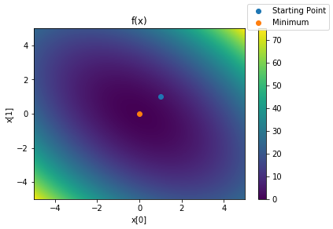
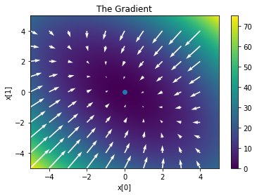
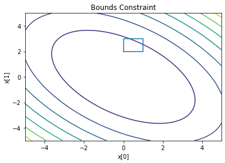
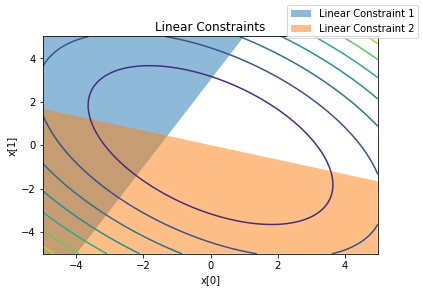
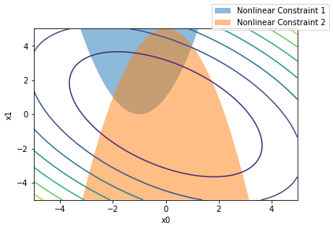

SciPy Minimize: Multidimensional Optimization
=============================================

.. raw:: html

   <hr>

 Table of Contents

-  `Function Form <#functions>`__
-  `Output Object <#output>`__
-  ```args`` and Function Parameters <#args>`__
-  `Routine Choice <#routine_choice>`__
-  `Routine Comparison <#routine_comparison>`__
-  `Gradients <#gradients>`__
-  `Hessians <#hessians>`__
-  `Bounds and Constraints <#bounds_constraints>`__

   -  `Bounds <#bounds>`__
   -  `Linear Constraints for ``trust-constr`` <#linear_trustconstr>`__
   -  `Non-linear Constraints for
      ``trust-constr`` <#nonlinear_trustconstr>`__
   -  `Constraints in ``SLSQP`` <#constraint_SLSQP>`__

-  `Conditioning <#conditioning>`__

.. raw:: html

   <hr>

The ``minimize`` routine in the ``scipy.optimize`` module provides
multidimensional optimization functionality. The function can call to a
`variety of different algorithms <#routine_comparison>`__ behind the
scenes depending on the specifics of the problem.

.. code:: ipython3

    # Importing the packages for the example
    #
    import numpy as np
    import scipy.optimize as optimize
    from mpl_toolkits.mplot3d import Axes3D
    import matplotlib.pyplot as plt

.. raw:: html

   <div id="functions" />

Function Form
-------------

.. raw:: html

   <hr>

The most important input to ``minimize`` is the objective function of
the form:

.. math::


   f: \mathbb{R}^d \rightarrow \mathbb{R}

 The function ``f`` takes inputs from a space of :math:`d` dimensional
real numbers, like a vector :math:`(x_0, x_1, ..., x_{d-1} )`, and maps
them to a scalar. Then we try to find the smallest value for that
scalar.

If you want to find a maximum instead, input ``-f`` to ``minimize``
instead of ``f``, and the algorithm will find ``f``\ ’s maximum.

For this tutorial, we use the example function:

.. math::


   f(\vec{x}) = x_0^2 + x_1^2 + x_0 x_1

See `Test_Functions <./Test_Functions.ipynb>`__ for functions that test
certain aspects of minimization routines.

.. code:: ipython3

    # Simplest test function
    f = lambda x : x[0]**2 + x[1]**2 + x[0]*x[1]

The Simplest Call
~~~~~~~~~~~~~~~~~

At the most basic, all you need to call minimize is: \* The objective
function \* A starting point

.. code:: ipython3

    starting_point=[1,1]
    
    result=optimize.minimize(f,starting_point)
    print(result)


.. parsed-literal::

          fun: 1.5869182200826406e-16
     hess_inv: array([[ 0.66666667, -0.33333333],
           [-0.33333333,  0.66666667]])
          jac: array([-6.91799246e-09, -6.91799246e-09])
      message: 'Optimization terminated successfully.'
         nfev: 12
          nit: 2
         njev: 3
       status: 0
      success: True
            x: array([-7.27305122e-09, -7.27305122e-09])


Let’s look at the function and the end result we just got.

The function chosen for the tutorial is a simple single parabolic bowl
without any tricky features to watch out for, but this won’t always be
true for more complicated functions.

.. code:: ipython3

    # Coordinates for plotting
    x0 = np.arange(-5,5,.01)
    x1 = np.arange(-5,5,.01)
    # creating 2D array
    x0_a, x1_a = np.meshgrid(x0,x1)
    
    # plotting our test functions
    fig, ax = plt.subplots()
    pos = ax.pcolormesh(x0_a,x1_a,f([x0_a,x1_a]) )
    ax.scatter(starting_point[0],starting_point[1],label='Starting Point')
    ax.scatter(result.x[0],result.x[1],label='Minimum')
    
    # labeling and measuring necessities
    fig.legend()
    fig.colorbar(pos,ax=ax)
    ax.set_title('f(x)')
    ax.set_xlabel('x[0]')
    ax.set_ylabel('x[1]')


.. parsed-literal::

    Text(0, 0.5, 'x[1]')





.. raw:: html

   <div id="output" />

Output Object
-------------

.. raw:: html

   <hr>

Minimize outputs a custom object, ``OptimizeResult``, which is based on
a Python dictionary.

Though it has some standard outputs, each method can return different
information.

Availible data can be accessed by

.. code:: ipython3

    result.keys()


.. parsed-literal::

    dict_keys(['fun', 'jac', 'hess_inv', 'nfev', 'njev', 'status', 'success', 'message', 'x', 'nit'])


And each attribute can be accessed as:

.. code:: ipython3

    result.x # the minimum


.. parsed-literal::

    array([-7.27305122e-09, -7.27305122e-09])


.. raw:: html

   <div id="args" />

``args`` and function parameters
--------------------------------

.. raw:: html

   <hr>

For a function with parameters and extra variables, the ``args``
parameter passes that variable to the function.

For example, if we add a parameter ``a`` that shifts the location of the
minimum in the ``x[1]`` direction:

.. code:: ipython3

    # Test function that uses a parameter a
    f_parameter = lambda x , a: x[0]**2 + (x[1]-a)**2 + x[0]*(x[1]-a)

Then then we can pass any valid variable to to ``args`` at evaluation
time:

.. code:: ipython3

    result_parameter2 = optimize.minimize(f_parameter,[1,1],args=(2))
    result_parameter3 = optimize.minimize(f_parameter,[1,1],args=(3))
    print("Minimum Location a=2: ",result_parameter2.x)
    print("Minimum Location a=3: ",result_parameter3.x)


.. parsed-literal::

    Minimum Location a=2:  [-6.46465798e-09  2.00000000e+00]
    Minimum Location a=3:  [-1.24749874e-06  3.00000100e+00]


.. raw:: html

   <div id="routine_choice" />

Choosing a Routine
------------------

.. raw:: html

   <hr>

You can choose a specific method by passing an argument to the
``method=`` flag, like Nelder-Method:

.. code:: ipython3

    result_Nelder_Mead=optimize.minimize(f,starting_point,method='Nelder-Mead')
    print(result_Nelder_Mead)


.. parsed-literal::

     final_simplex: (array([[ 2.93637382e-06, -1.76886206e-05],
           [-5.26241709e-05,  4.58888034e-05],
           [ 5.46892983e-07,  7.08686217e-05]]), array([2.69569189e-10, 2.46022541e-09, 5.06141818e-09]))
               fun: 2.695691885846764e-10
           message: 'Optimization terminated successfully.'
              nfev: 70
               nit: 38
            status: 0
           success: True
                 x: array([ 2.93637382e-06, -1.76886206e-05])


Methods can use different information, like gradients, hessians, or
constraints, and can return different information within the
``OptimizeResult`` object. For an indepth discussion of the various
methods, see `Routine Comparison <#routine-comparison>`__.

.. raw:: html

   <div id="gradients" />

Gradients
---------

.. raw:: html

   <hr>

The gradient, also known as jacobian, of a scalar valued function
:math:`f` is defined as:

.. math::


   \nabla f = \begin{bmatrix}
   \frac{\partial f(x)}{\partial x_0} & \frac{\partial f(x)}{\partial x_1} & \dots & \frac{\partial f(x) }{\partial x_d}  
   \end{bmatrix}

 The gradient says in which direction the function is decreasing/
increasing the most. So we only need to follow that direction to find
the minimum. We can also think about using the gradient to construct a
local approximation of the function, and then finding the minimum of
that local approximation.

The gradient also provides some sanity checks. If you think the
algorithm is using the gradient, check if you result objects provides a
``jac`` approximation at the end. Also, local extrema or saddle points
should have a gradient of :math:`\vec{0}`. If you are solving a bounded
problem, and the gradient of the fucntion at the solution is not
:math:`\vec{0}`, then the bounds matter.

Derivatives can be supplied to CG, BFGS, Newton-CG, L-BFGS-B, TNC,
SLSQP, dogleg, truct-ncg, trust-krylov, trust-exact, and trust-constr.

The gradient of our tutorial function evaluates to:

.. math::


   \nabla \left( x_0^2 + x_1^2 + x_0 x_1 \right)= \begin{bmatrix}
   2 x_0 + x_1 & 2 x_1 + x_0
   \end{bmatrix}

First write a function to return a numpy array, like:

.. code:: ipython3

    def df (x):
        df_dx0 = 2*x[0] + x[1]
        df_dx1 = 2*x[1] + x[0]
        return np.array([df_dx0, df_dx1])

To see how this might be useful, let’s look at a quiver plot of the
gradient.

The negative of the gradient seems to point more or less right toward
the minimum.

.. code:: ipython3

    # Setting up the data
    x0_quiver=np.arange(-5,5,1)
    x1_quiver=np.arange(-5,5,1)
    x0_a_quiver, x1_a_quiver = np.meshgrid(x0_quiver,x1_quiver)
    df_quiver=df([x0_a_quiver,x1_a_quiver])
    
    # Plotting the Data
    fig, ax = plt.subplots()
    pos = ax.pcolormesh(x0_a,x1_a,f([x0_a,x1_a]))
    ax.quiver(x0_quiver,x1_quiver,-df_quiver[0,:,:],-df_quiver[1,:,:], color='white')
    ax.scatter(result.x[0],result.x[1],label='Minimum')
    
    # Labeling
    fig.colorbar(pos,ax=ax)
    ax.set_xlabel('x[0]')
    ax.set_ylabel('x[1]')
    ax.set_title('The Gradient')


.. parsed-literal::

    Text(0.5, 1.0, 'The Gradient')





If we have the gradient/ jacobian, we can pass that to the solver via
the ``jac``, jacobian, flag:

.. code:: ipython3

    result_jac = optimize.minimize(f,starting_point,jac=df)
    print(result_jac.message,"\t",result_jac.jac)


.. parsed-literal::

    Optimization terminated successfully. 	 [3.33066907e-16 3.33066907e-16]


We can also input both the function and it’s derivative at the same
time. This could be efficient if both repeat many of the same
computations.

When ``jac`` flag recieves the Boolean ``True``, ``minimize`` knows to
look for the derivative with the function. We also need to define a new
function that returns a both a function and it’s derivative at the time:

.. code:: ipython3

    def f_jac_together (x):
        return f(x),df(x)
    
    result_jac_together = optimize.minimize(f_jac_together,starting_point,jac=True)
    print(result_jac_together.message,"\t",result_jac_together.jac)


.. parsed-literal::

    Optimization terminated successfully. 	 [3.33066907e-16 3.33066907e-16]


Let’s just double check our manual derivatives. Maybe something went
wrong. Luckily, ``optimize`` provides a rountine for this:

.. code:: ipython3

    location=np.random.rand(2)
    optimize.check_grad(f,df,location)


.. parsed-literal::

    1.3930805828241055e-08


By returning near zero, the rountine confirms that our manual gradient
is basically identical to a finite derivative method at a random
location.

If we don’t provide a function for the derivative, the routines can use
a finite approximation instead. If a method requiring a derivative is
specified, but no derivative is given, then a finite approximation is
used.

.. code:: ipython3

    result_CG1=optimize.minimize(f,starting_point,method='CG')
    print("Is there a jacobian? ",result_CG1.jac)


.. parsed-literal::

    Is there a jacobian?  [2.13371764e-08 2.13371764e-08]


We could also specify ``jac=False``.

This doesn’t mean don’t use the jacobian. It means don’t use an
analytical formula, but instead use a discrete numerical calculation for
the jacobian:

.. code:: ipython3

    result_CG2=optimize.minimize(f,starting_point,jac=False)
    print("Is there a jacobian? ",result_CG2.jac)


.. parsed-literal::

    Is there a jacobian?  [-6.91799246e-09 -6.91799246e-09]


We could also specify ``2-point``, which is a specific method of
discretely calculating the derivatives:

.. code:: ipython3

    result_2point=optimize.minimize(f,[1,1],jac='2-point')
    print("Is there a jacobian? ",result_2point.jac)


.. parsed-literal::

    Is there a jacobian?  [-6.91799246e-09 -6.91799246e-09]


The optimize module also provides the function to look at this discrete
calculation itself:

.. code:: ipython3

    delta=np.array([1e-6,1e-6])
    
    optimize.approx_fprime(starting_point,f, delta )


.. parsed-literal::

    array([3.000001, 3.000001])


Only in ``trust-constr``!!!!!
^^^^^^^^^^^^^^^^^^^^^^^^^^^^^

we have two other ways of discretely calculating the derivatives,
``'3-point'`` and ``'cs'`` in the method\ ``trust-constr``.

``trust-constr`` isn’t the best method for this particular ``f``, but we
don’t care about that here.

.. code:: ipython3

    result_3point = optimize.minimize(f,starting_point,jac='3-point',method='trust-constr')
    result_2point_tc = optimize.minimize(f,starting_point,jac='2-point',method='trust-constr')
    result_cs = optimize.minimize(f,starting_point,jac='cs',method='trust-constr')
    print(result_3point.message,"\t",result_2point_tc.message,"\t",result_cs.message)


.. parsed-literal::

    `gtol` termination condition is satisfied. 	 `xtol` termination condition is satisfied. 	 `gtol` termination condition is satisfied.


.. parsed-literal::

    /home/shaula/anaconda3/lib/python3.7/site-packages/scipy/optimize/_hessian_update_strategy.py:187: UserWarning: delta_grad == 0.0. Check if the approximated function is linear. If the function is linear better results can be obtained by defining the Hessian as zero instead of using quasi-Newton approximations.
      'approximations.', UserWarning)


.. raw:: html

   <div id="hessians" />

Hessians
--------

.. raw:: html

   <hr>

Hessians can be supplied to: \* Newton-CG \* dogleg \* trust-ncg \*
trust-krylov \* trust-exact \* trust-constr

Thes Hessian is defined as:

.. math::


   H(\vec{x}) = \begin{bmatrix}
   \frac{\partial^2 f(x)}{\partial x_0^2} & \frac{\partial^2 f(x)}{\partial x_0 \partial x_1} & \dots & \frac{\partial^2 f(x)}{\partial x_0 \partial x_d} \\
   \frac{\partial^2 f(x)}{\partial x_1 \partial x_0} & \frac{\partial^2 f(x)}{\partial x_1^2 } & \dots & \frac{ \partial^2 f(x)}{\partial x_1 \partial x_d} \\
   \dots & \dots & & \dots \\
   \frac{\partial^2 f(x)}{\partial x_d \partial x_d} & \frac{\partial^2 f(x)}{\partial x_d \partial x_1} & \dots & \frac{\partial^2 f(x)}{\partial x_d^2}
   \end{bmatrix}

While the gradient provides :math:`d` more computations per iteration,
these extra computations often pay off in terms of added efficiency. The
Hessian, though, adds :math:`d^2` extra computations per calculation for
only quadratic better information. This doesn’t always pay off in terms
of computational efficiency.

For our test function of:

.. math::


   f(\vec{x}) = x_0^2 + x_1^2 + x_0 x_1

 the Hessian evaluates to:

.. math::


   H(\vec{x}) = \begin{bmatrix}
   2 & 1 \\
   1 & 2 
   \end{bmatrix}

 which we can write into a function:

.. code:: ipython3

    d2f = lambda x: np.array([[2,1],[1,2]])

We can then send this function to ``minimize`` via the ``hess`` option.
We also need to specify a method that can take advantage of the hessian:

.. code:: ipython3

    result_hess=optimize.minimize(f,starting_point,method='Newton-CG',jac=df,hess=d2f)


Positive Definite
^^^^^^^^^^^^^^^^^

``dogleg`` requires the Hessian to be positive definite.

If a point is actually a minimum, the Hessian is positive difinite.
Implies convex.

For any vector :math:`x`,

.. math::


   x^T H x >0

We can check this equation at our minimum using a randomly generated
:math:`x`:

.. code:: ipython3

    x=np.random.rand(2)
    x.dot(d2f(result.x).dot(x))>0


.. parsed-literal::

    True


Hessian shortcut
^^^^^^^^^^^^^^^^

Availible in Newton-CG, trust-ncg, trust-krylov, trust-constr

If the entire Hessian is too unwieldy to calculate, the Hessian times a
vector $ :raw-latex:`\mathbf{H}` :raw-latex:`\vec{p}`$ can be used
instead for certain methods like Newton- CG.

Given our known Hessian, we can analytically calculate this in our
example as:

.. math::


   H \vec{p} = \begin{bmatrix}
   2 & 1 \\ 1 & 2 \\
   \end{bmatrix} \begin{bmatrix}
   p_0 \\ p_1 
   \end{bmatrix}
   = 
   \begin{bmatrix}
   2 p_0 + p_1 \\ p_0 + 2 p_1
   \end{bmatrix}

.. code:: ipython3

    d2f_p = lambda x , p : np.array([ 2*p[0]+p[1] , p[0]+2*p[1] ])

.. code:: ipython3

    result_hessp= optimize.minimize(f,starting_point,jac=df,method='Newton-CG',hessp=d2f_p)
    print(result_hessp.message)


.. parsed-literal::

    Optimization terminated successfully.


.. raw:: html

   <div id="bounds_constraints" />

Bounds and Constraints
----------------------

.. raw:: html

   <hr>

.. raw:: html

   <div id="bounds" />

Bounds
^^^^^^

Work on TNC, L-BFGS-B, and trust-constr

For example, a hard box:

.. math::


   0 < x_0<1, 2<x_1 <3

Let’s plot what this looks like:

.. code:: ipython3

    fig, ax = plt.subplots()
    plt.ylim(-5,5)
    ax.contour(x0_a,x1_a,f([x0_a,x1_a]))
    ax.plot([0,0,1,1,0],[2,3,3,2,2],label='Bounds')
    
    ax.set_title('Bounds Constraint')
    ax.set_xlabel('x[0]')
    ax.set_ylabel('x[1]')


.. parsed-literal::

    Text(0, 0.5, 'x[1]')





.. code:: ipython3

    # create bounds object array of lower limits then array of upper limits
    bounds=optimize.Bounds([0,2],[1,3])
    result_bounds=optimize.minimize(f,[1.5,1.5],bounds=bounds)
    print(result_bounds)


.. parsed-literal::

          fun: 4.0
     hess_inv: <2x2 LbfgsInvHessProduct with dtype=float64>
          jac: array([1.99999999, 3.99999998])
      message: b'CONVERGENCE: NORM_OF_PROJECTED_GRADIENT_<=_PGTOL'
         nfev: 6
          nit: 1
       status: 0
      success: True
            x: array([0., 2.])


.. raw:: html

   <div id="linear_trustconstr" />

Linear constraints for ``trust-constr``
~~~~~~~~~~~~~~~~~~~~~~~~~~~~~~~~~~~~~~~

Note: ``trust-constr`` requires gradient and hessian Linear constraints
take the general form:

.. math::


   n_{lower} < \vec{A} \cdot \vec{x} < n_{upper}

While I might think of a constraint in a form like this example:

.. math::


   2 x_0 +3 <x_1

 as I can then graphically imagine “``x[1]`` is restricted to be above
this line”. But I can move it into a form that looks like the general
form:

.. math::


   -\infty < 2 x_0 - 1 x_1 < -3

I will also use a second linear constraint, with a geometric form of

.. math::


   x_1 < \frac{1}{3} x_0

 and a constraint form of

.. math::


   0 < x_0 + 3 x_1 < \infty

.. code:: ipython3

    fig, ax = plt.subplots()
    plt.ylim(-5,5)
    ax.contour(x0_a,x1_a,f([x0_a,x1_a]))
    ax.fill_between(x0,2*x0+3,5,alpha=0.5,label='Linear Constraint 1')
    ax.fill_between(x0,-1/3*x0,-5,alpha=0.5,label='Linear Constraint 2')
    
    ax.set_xlabel('x[0]')
    ax.set_ylabel('x[1]')
    ax.set_title('Linear Constraints')
    fig.legend()


.. parsed-literal::

    <matplotlib.legend.Legend at 0x7f790a1fcfd0>





.. code:: ipython3

    n_lower1=-np.inf
    n_upper1=-3
    A1=[-1,2]
    
    linear_constraint = optimize.LinearConstraint(A1,n_lower1,n_upper1)

We can input two constraints at the same time by combining each input in
an array:

.. code:: ipython3

    n_lower2=0
    n_upper2=np.inf
    A2=[-3,1]
    
    linear_constraint2= optimize.LinearConstraint([A1,A2],[n_lower1,n_lower2],
                                                 [n_upper1,n_upper2])

We then pass the linear constraint object to ``minimize`` via the
``constraint`` parameter:

.. code:: ipython3

    result_linearconstraint=optimize.minimize(f,[2,0],
                        method='trust-constr',jac=df,hess=d2f,
                      constraints=linear_constraint)
    print(result_linearconstraint.message)


.. parsed-literal::

    `gtol` termination condition is satisfied.


.. raw:: html

   <div id="nonlinear_trustconstr" />

Non-linear Constraint in ``trust-constr``
~~~~~~~~~~~~~~~~~~~~~~~~~~~~~~~~~~~~~~~~~

Nonlinear constraints objects fall into the form:

.. math::


   n_{lower} < c(x) < n_{upper}

Here, we use the concrete example:

.. math::


   -\infty < x_0^2 +2 x_0 - x_1 < -1

 Where we could also write our constraint as

.. math::


   (x_0 + 1)^2 < x_1

 We can graphically see what this example looks like:

.. code:: ipython3

    fig, ax = plt.subplots()
    plt.ylim(-5,5)
    ax.contour(x0_a,x1_a,f([x0_a,x1_a]))
    ax.fill_between(x0,(x0+1)**2,5,alpha=0.5,label='Nonlinear Constraint 1')
    ax.fill_between(x0,-x0**2+5,-5,alpha=0.5,label='Nonlinear Constraint 2')
    
    ax.set_xlabel('x0')
    ax.set_ylabel('x1')
    fig.legend()


.. parsed-literal::

    <matplotlib.legend.Legend at 0x7f790a07ec10>





We create a nonlinear constraint object in much the same way that we
created a linear constraint object.

.. code:: ipython3

    n_lower1=-np.inf
    n_upper1= -1
    
    c1 = lambda x : x[0]**2 - 2* x[0] - x[1]
    
    nonlinear_constraint=optimize.NonlinearConstraint(c1,n_lower1,n_upper1)

If we want to add two or more constraints to the same system, we use
arrays to combine them into the same input

Let’s add

.. math::


   x_1 < -x_0^2+ 5

.. math::


   -5 < -x_0^2 - x_1 < \infty

.. code:: ipython3

    n_lower2=-5
    n_upper2=np.inf
    
    c2 = lambda x : -x[0]**2 - x[1]
    
    nonlinear_constraint2=optimize.NonlinearConstraint([c1,c2],[n_lower1,n_lower2],[n_upper1,n_upper2])

Again just like a linear constraint, we pass this object to
``constraint``:

.. code:: ipython3

    result_nonlinearconstraint=optimize.minimize(f,[2,0],method='trust-constr',jac=df,hess=d2f,
                      constraints=nonlinear_constraint)
    print(result_nonlinearconstraint.message)


.. parsed-literal::

    `gtol` termination condition is satisfied.


.. code:: ipython3

    result_2constraints=optimize.minimize(f,[2,0],method='trust-constr',jac=df,hess=d2f,
                      constraints=[linear_constraint,nonlinear_constraint])
    print(result_2constraints.message)


.. parsed-literal::

    The maximum number of function evaluations is exceeded.


Enforcing nonlinear constraints uses the gradient and hessian. Just like
for the general functions, the derivatives for the constraints can be
provided and the method of calculation can be controlled.

.. raw:: html

   <div id="constraint_SLSQP" />

Constraints in SLSQP
~~~~~~~~~~~~~~~~~~~~

Used for SLSQP

Equality constraint

.. math::


   c(x) = 0 

Inequality Constraint

.. math::


   c(x) \geq 0

.. code:: ipython3

    c = lambda x : -(x[0]-1)**2 + x[1] 
    
    eq_cons= {'type':'ineq',
                'fun': [c,c2]}

.. code:: ipython3

    c([x0_a,x1_a])>0


.. parsed-literal::

    array([[ True,  True,  True, ...,  True,  True,  True],
           [ True,  True,  True, ...,  True,  True,  True],
           [ True,  True,  True, ...,  True,  True,  True],
           ...,
           [ True,  True,  True, ...,  True,  True,  True],
           [ True,  True,  True, ...,  True,  True,  True],
           [ True,  True,  True, ...,  True,  True,  True]])


.. code:: ipython3

    optimize.minimize(f,[1,1],method='SLSQP',constraints=ineq_cons)


.. parsed-literal::

         fun: 0.0
         jac: array([1.49011612e-08, 1.49011612e-08])
     message: 'Optimization terminated successfully.'
        nfev: 9
         nit: 2
        njev: 2
      status: 0
     success: True
           x: array([0., 0.])


.. raw:: html

   <div id="routine_comparison" />

Routine Comparison
------------------

.. raw:: html

   <hr>

No method is a golden hammer, that works well on every problem. Each has
strengths or weakness, dealing with aspects of the posed problem.

When choosing a method, consider for your problem:

-  Computational intensity of one evaluation
-  Number of dimensions
-  Derivatives

   -  Even differentiable?
   -  Analytic gradient/ Hessian?

-  Constraints
-  How non-linear
-  Convex/ concave

If the function doesn’t have even a trustworthy numerical derivatives,
the Nelder-Mead simplex algorithm can find a minimum without them.

Other generally methods fall into either the Line Search or trust region
categories.

Right now, this is just a bunch of scribbled notes…

Nelder-Mead simplex method: Derivative free optimization

Gradient/ Line Methods: \* Conjugate Gradient \* Newton-CG (zeros the
gradient) good if cheap hessian

L-BFGS suitable for large numbers of variables Quasi-Newton methods:
Hessian approximated by recent evaluations

Constraints: \* Constrained optimization by linear approximation COBYLA
\* Sequential Quadratic Programming SLSQP \* trust-constr \* TNC?
truncated newton algorithm \* L-BFGS-B

Hessian postivie definate?

What means to be large scale problem?

So we have newton-cg AND TNC, same thing, but TNC permits bounds

Derivatives can be supplied to: \* CG \* BFGS \* Newton-CG \* L-BFGS-B
\* TNC \* SLSQP \* dogleg \* truct-ncg \* trust-krylov \* trust-exact \*
trust-constr

Hessians can be supplied to: \* Newton-CG \* dogleg \* trust-ncg \*
trust-krylov \* trust-exact \* trust-constr

.. raw:: html

   <div id="#conditioning" />

Conditioning
------------

.. raw:: html

   <hr>

